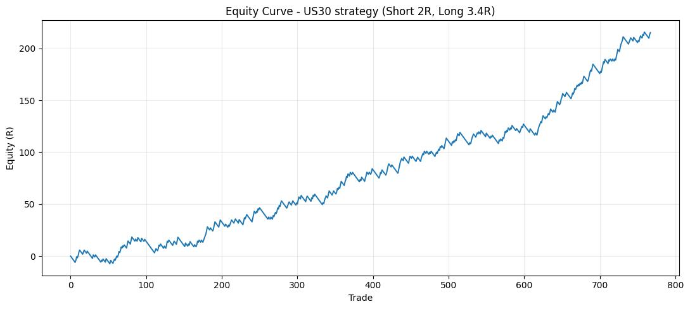
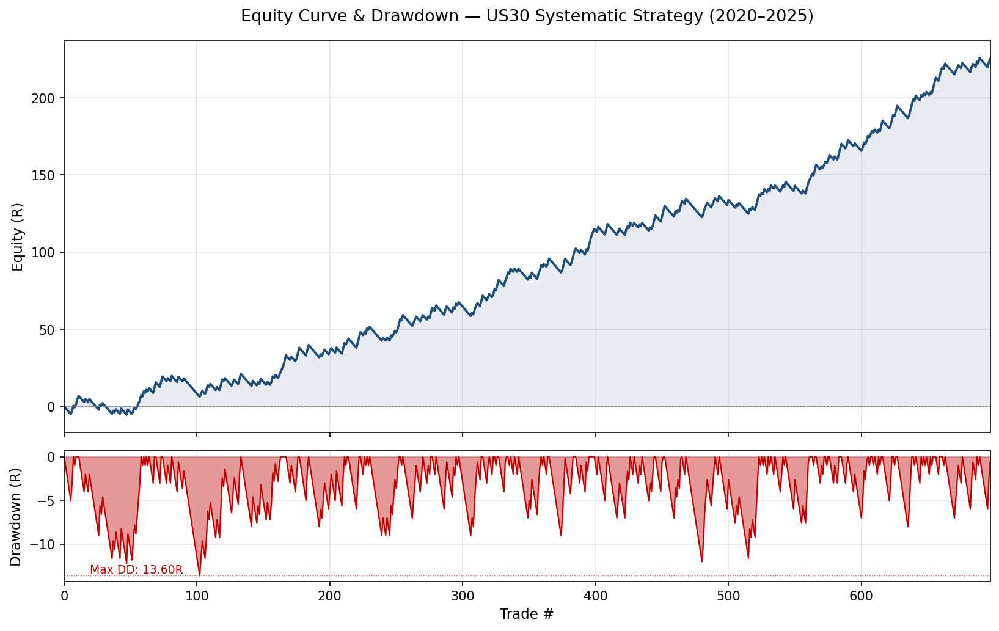
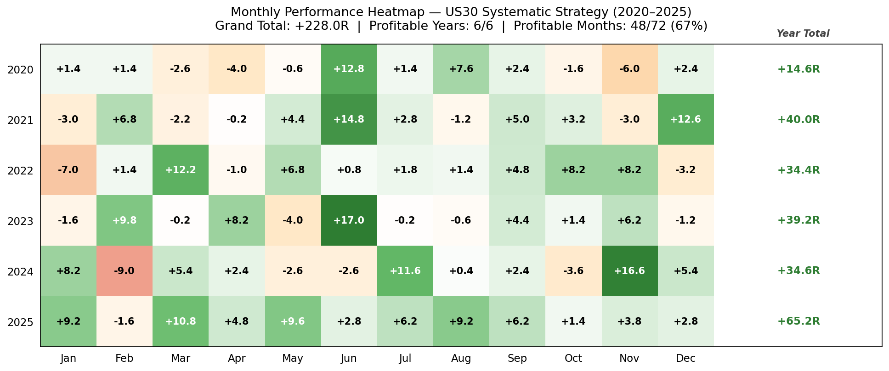
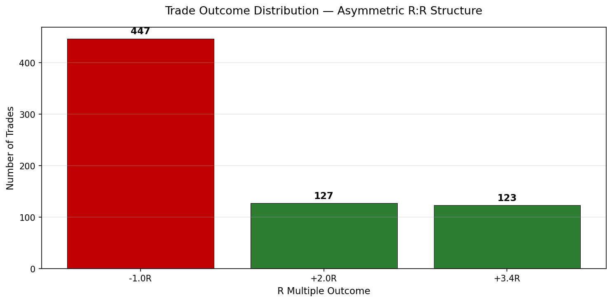

# Systematic Intraday Trading Strategy — Dow Jones (US30)

**Fully mechanical, rule-based intraday system | 6 consecutive profitable years (2020–2025)**

---

## Overview

This project documents the independent development and validation of a fully systematic intraday trading strategy on the Dow Jones Industrial Average (US30), operating on a 5-minute timeframe.

The system is **100% rule-based**: every entry, exit, and filter is defined in advance. There is no discretionary component during execution, which eliminates human error and psychological bias — two of the most common sources of underperformance in active trading.

The strategy was developed and refined over 6 years of out-of-sample testing and live observation, covering multiple market regimes including the 2020 pandemic-driven volatility, the 2022 bear market, and the 2023–2025 recovery.

---

## Methodology

Each component of the system was designed and tested **in isolation** before being integrated into the final ruleset. A filter was retained only if it demonstrated a statistically positive contribution to overall performance.

**Core design principles:**
- Pattern-based entry logic rooted in recurring market structures
- Asymmetric risk/reward: **Long trades target 3.4R, Short trades target 2R**
- Operational filters applied to reduce noise and exposure to low-edge conditions

**Validation approach:**
- Each filter backtested standalone
- Retained only if it produced a statistically meaningful improvement in expectancy or drawdown
- No curve-fitting: rules are simple, robust, and consistent across years

---

## Headline Performance (2020–2025)

| Metric | Value |
|---|---|
| Annualized Sharpe Ratio | **1.97** |
| Calmar Ratio | **2.76** |
| Annualized Sortino Ratio | **4.35** |
| Total R Generated | **+225.2R** |
| Expectancy per Trade | **+0.323R** |
| Profit Factor | **1.5** |
| Win Rate | 35.9% |
| Total Trades | 697 |
| Max Drawdown | 13.6R |
| Max Losing Streak | 12 consecutive SL |
| **Profitable Years** | **6 / 6** |

### Equity Curve

### Equity & Drawdown

Maximum drawdown of 13.6R against +225R generated equals approximately **6% peak-to-trough exposure** on total returns — a result of the asymmetric R:R structure combined with strict per-trade risk capping.

---

## Annual Performance Breakdown

| Year | Result | Status |
|---|---|---|
| 2020 | +14.6R | ✅ Profitable |
| 2021 | +40.0R | ✅ Profitable |
| 2022 | +34.4R | ✅ Profitable |
| 2023 | +39.2R | ✅ Profitable |
| 2024 | +34.6R | ✅ Profitable |
| 2025 | +65.2R | ✅ Profitable |

### Monthly Performance Heatmap

Across 72 months: **48 positive (67%)**, 24 negative. Maximum monthly gain +17.0R (Jun 2023). Maximum monthly loss -9.0R (Feb 2024). The strategy delivered positive contribution in every calendar year despite varied market regimes.

---

## Trade Outcome Distribution

The asymmetric R:R structure is visible directly in the outcome distribution: most trades resolve to either +3.4R (Long TP), +2R (Short TP), or -1R (SL).

This is by design: the system accepts a sub-50% win rate in exchange for high reward-to-risk ratios on winners, producing positive expectancy through asymmetry rather than win frequency.

---

## Risk Management

Risk is managed through an **R-multiple framework**: each trade risks a fixed unit (1R) of account equity, defined before entry. This makes performance independent of capital size and allows clean comparison across timeframes and instruments.

Key risk principles:
- Fixed pre-defined risk per trade (1R)
- Asymmetric reward structure to maintain positive expectancy at sub-50% win rate
- Drawdown monitored as multiple of average R, not as % of equity
- Max losing streak (12 SL) absorbed in 6 years with full equity recovery

---

## Tools & Platforms

- **Backtesting & analysis:** TradingView, Excel
- **Forward testing & live execution:** MetaTrader 5, cTrader
- **Data:** Historical and live intraday US30 data

---

## Files in This Repository

- `equity_curve.png` — Trade-by-trade equity curve
- `equity_and_drawdown.png` — Equity curve with drawdown subplot
- `yearly_performance.png` — Annual R generated breakdown
- `monthly_heatmap.png` — Monthly performance across 6 years
- `r_distribution.png` — Trade outcome distribution
- `US30_Trade_Log.xlsx` — Sanitized trade log (697 trades, direction, outcome, R result, cumulative)

---

## Honest Reflections & Limitations

A few points worth stating openly:

- **Win rate is intentionally low (~36%).** The edge comes from R:R asymmetry, not from win frequency. This requires discipline through losing streaks — psychologically demanding even on a fully mechanical system.
- **Single-instrument focus.** The strategy is calibrated for US30 microstructure. Transferability to other indices (NDX, SPX, DAX) would require dedicated re-validation.
- **No regime-switching logic.** The system relies on robustness across regimes rather than active adaptation. This is intentional but caps the upside in trending environments.
- **Execution assumptions.** Backtest assumes realistic spreads and slippage, but live performance will always differ marginally from simulated results.

---

## Next Steps

- **Full automation:** Currently translating the system into an automated execution bot through AI-assisted development. Goal: end-to-end automation of signal generation, order management, and risk controls.
- **Multi-asset extension:** Exploring whether the core logic can be re-calibrated for additional equity indices.
- **Statistical refinement:** Ongoing research on alternative filters and exit logic to improve Sortino without compromising robustness.

---

## About

Developed independently by **Alberto Sestili**, MSc Finance student at LUISS Guido Carli, Rome.

📫 Contact: albertosestili02@gmail.com
🔗 LinkedIn: [Alberto Sestili](https://www.linkedin.com/in/alberto-sestili-63aa01182/)
